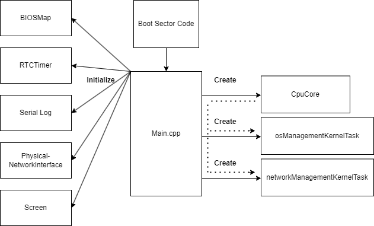
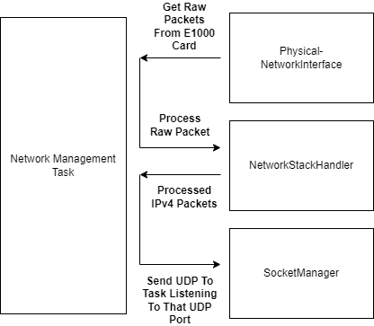
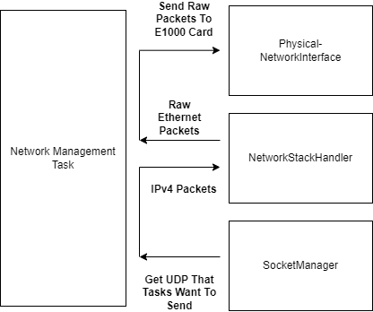
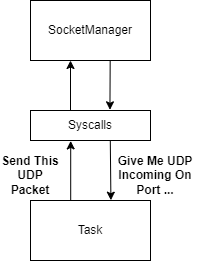
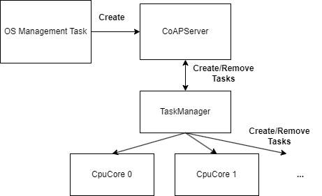

# Code Architecture

The following sections go over how the operating system code works. This is high-level and doesn't go into details.

# Boot and Main.cpp

### Explained

The machine will first load in the bootsector, which is the code found in  `operating_system/boot`. This code will load the kernel and jump to the code in `operating_system/main/kernel_entry.asm` which will just jump to the main function in `operating_system/main/main.cpp`.

The main function basically does the following:

- Initialize some global resources like the screen, e1000 network card etc. These classes can all be found at `operating_system/global_resources`.
- Create a `CpuCore` object, see `operating_system/cpu_core/cpu_core.h`, and then it will call `bind()` on this object, meaning that this `CpuCore` will represent the core that is executing the main function. The idea here is that each core will need to create such an object and bind to it, but currently the code only supports running with a single CPU core (APIC setup etc. is not implemented).
- Create two tasks for the `CpuCore`:
    - A Network Management Task
    - An OS Management Task

Next sections will explain what the purpose is of these tasks. After the tasks are created, task switching will cause these tasks to start executing (task switching is setup by the `CpuCore`).

# Network Management Task

The components from these diagram can all be found under the `operating_system/network_management_task` folder.

Above images show the two things the Network Management Task is used for:

- Getting received packets from the physical network interface to tasks
- Sending packets from tasks to the physical network interface

Tasks indirectly interact with the `SocketManager` through syscalls. See the SycallHandler functions in `operating_system/cpu_core/cpu_core.cpp` for details on how the syscalls specifically interact with the `SocketManager`.

One detail which has been omitted here, is that on top of a `PhysicalNetworkInterface`, there is also a `LoopbackNetworkInterface`. The difference is of course that the `LoopbackNetworkInterface` is used when the operating system sends/receives packets to/from itself while the `PhysicalNetworkInterface` sends/receives packets from other devices on the network.

# OS Management Task

The components for the OS Management Task can be found under the `operating_system/os_management_task` folder except the `CoAPServer` class which is found under the `cpp_lib` folder.

Basically the OS Management Task is where the `CoAPServer` runs which handles the API for adding and removing tasks on the operating system. The `TaskManager` is responsible for scheduling these tasks to the different `CpuCore`'s. However since currently only one `CpuCore` is utilized, this is very simplistic.