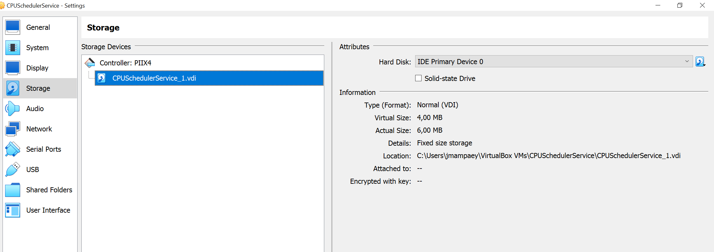
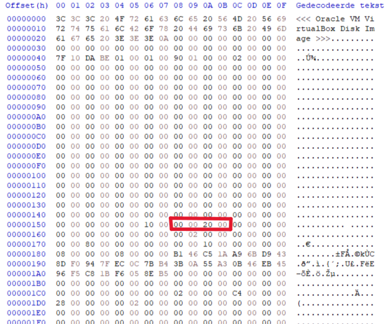
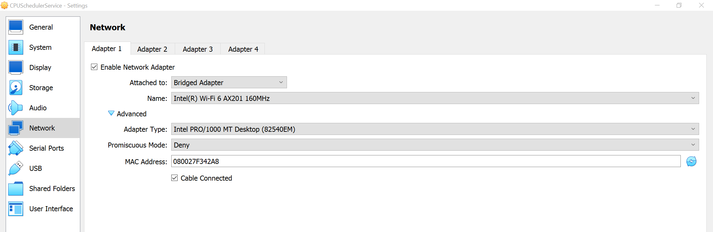
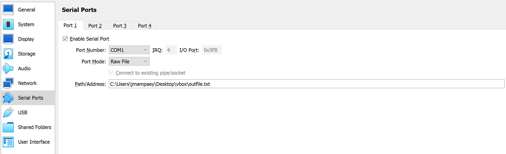
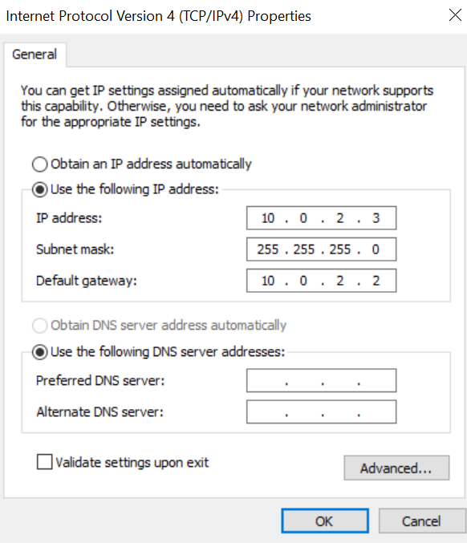
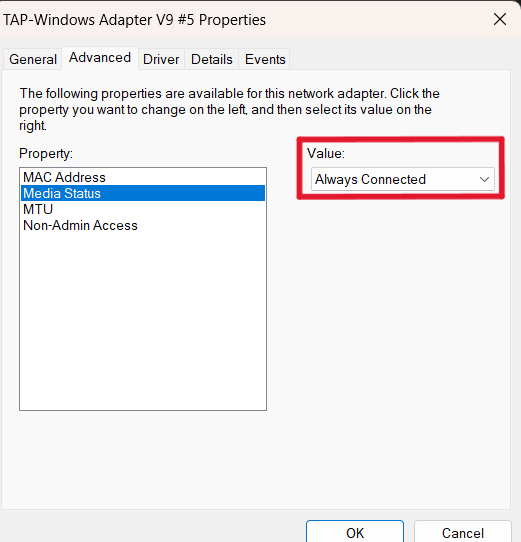

# What We Need to Do

For the operating system setup, you need to:

1. Configure the disk file.
2. Set up an e1000 network adapter.
3. Allocate sufficient RAM.

For end-to-end testing, connect a serial port of the machine to a file and capture network traffic in a pcap file.

As mentioned in the `README.md`, this operating system is built for x86 CPUs and has been tested with both AMD and Intel processors. It will not run on an ARM CPU.

# Required Base Memory

The base memory size determines how many tasks can run concurrently. To run "x" tasks, the theoretical minimum base memory required is:

```
34 MB + x * 8.5 MB
```

However:

- The `NUM_POSSIBLE_TASKS` macro in [cpu_core.h](cpu_core-header.md) limits the maximum number of tasks to 50.
- Testing has been limited to 2048 MB of base memory.

Thus, it is recommended to use at least 2048 MB of base memory.

# VirtualBox

### Minimal Setup

**Install VirtualBox**: 
Download the installer [here](https://www.virtualbox.org/wiki/Downloads).

**Create a New Machine**:

- Do not select an ISO file.
- Configure the base memory according to the [Required Base Memory](#required-base-memory) section.
- Choose the number of CPU cores (currently, the OS can only use one core).
- Do not create a virtual hard drive during setup.

**Configure the Machine**:

- Go to the Storage settings.
- Remove the current controller.
- Add a new PIIX4 controller.
- Click on this controller and select "Add Hard Disk".
- Create a new VDI file with "Pre-allocate Full Size" and choose a minimum size of 4 MB. Click "Finish" and then "Choose".

The final Storage configuration should look like this:



Notes:

- The file path of the VDI file is important. Remember this as the "disk file path".
- Open the VDI file with a binary editor (e.g., [HxD](https://mh-nexus.de/en/hxd/) on Windows). At bytes 0x158, 0x159, 0x15A, and 0x15B, you will find a value in [**little endian**](https://en.wikipedia.org/wiki/Endianness) representing where the disk begins. This value is often 0x00200000 (2097152 in decimal). Remember this as the "disk start offset". 



**Set Up the Network Adapter**:

- Go to the Network settings.
- In Adapter 1, set "Attached to:" to Bridged Adapter instead of NAT.
- In Advanced, select the 82540EM adapter type. Note the MAC address of the adapter.



### End-to-End Testing Setup

For end-to-end testing, create a file somewhere called `outfile.txt`, remember this as the "serial logfile path". Then setup the following in the settings of your VirtualBox machine:



Next you need to locate the path to the [`VBoxManage.exe`](https://www.virtualbox.org/manual/ch08.html) executable, this is a command line tool for VirtualBox and should be included in the normal VirtualBox installation. Let's denote the following variables:

- **VBOX_MANAGE_EXE**: Path to `VBoxManage.exe`.
- **VBOX_MACHINE_NAME**: The name of the new machine that we setup [earlier](#virtualbox).
- **VBOX_DUMP_FILE**: This is where VirtualBox will create a packet capture for the network adapter of our VirtualBox machine. Call the file `dump.pcap` (thus for example **VBOX_DUMP_FILE** could be `/Users/dummy/Desktop/dump.pcap`), you are free to choose where you want to place it but remember the path as the "packet capture path".

Then to tell VirtualBox to create packet captures, execute the following command:

```
CPU_SCHEDULER_SERVICE> {VBOX_MANAGE_EXE} modifyvm {VBOX_MACHINE_NAME} --nictrace1 on --nictracefile1 {VBOX_DUMP_FILE}
```

# QEMU

### Minimal Setup

Download and install QEMU from [here](https://www.qemu.org/download/). After installation, ensure you can locate the `qemu-system-x86_64.exe` executable.

For QEMU, we will need a TAP adapter. On Windows, an easy way to achieve this is by installing OpenVPN from [here](https://openvpn.net/community-downloads/). After installing OpenVPN, when going to network connections you should see the following new connection:


Remember this name ("OpenVPN TAP-Windows...") as the "TAP adapter name". On this connection, go to "Properties" -> "Internet Protocol Version 4 (TCP/IPv4)" and configure as follows:



This means that this TAP network will have subnet 10.0.2.0/24 and your actual computer has IP address 10.0.2.3 on this network while the gateway will have IP address 10.0.2.2. Next go again to "Properties" -> "Configure..." -> "Advanced" -> "Media Status" and choose "Always Connected":



Optionally, you can look into bridging the TAP adapter with another network adapter that has actual internet connectivity. However, this will not be covered further here.

Next, we need to create an image.bin file somewhere which will be the disk for QEMU. Create a folder somewhere (we'll call it `QEMU_DIR`) and within it, create a 4MB file called `image.bin`. This file will serve as the disk for QEMU. We'll refer to the path of this file as the "disk file path".

Let's denote the following variables:

- **QEMU_EXE**: Path to `qemu-system-x86_64.exe`.
- **QEMU_DISK_FILE**: The disk file path (e.g., `QEMU_DIR/image.bin`).
- **QEMU_TAP**: The name of the TAP adapter.
- **QEMU_MAC**: A custom MAC address for the virtual machine's network adapter (format: `xx:xx:xx:xx:xx:xx`).

To launch QEMU, we can then use the following command:

```
CPU_SCHEDULER_SERVICE> {QEMU_EXE} -drive format=raw,file="{QEMU_DISK_FILE}"" -netdev tap,id=u1,ifname="{QEMU_TAP}" -device e1000,netdev=u1,mac="{QEMU_MAC}"
```

### End-to-End Testing Setup

For end-to-end testing, create a file somewhere called `outfile.txt`, remember this as the "serial logfile path".

Next create a file somewhere called `cmd_params.cfg`, remember this as the "qemu config path". This file, we will fill with command line arguments for QEMU. Let's once again denote some variables:

- **QEMU_DISK_FILE**: The disk file path (e.g., `QEMU_DIR/image.bin`).
- **QEMU_TAP**: The name of the TAP adapter.
- **QEMU_MAC**: A custom MAC address for the virtual machine's network adapter (format: `xx:xx:xx:xx:xx:xx`).
- **QEMU_SERIAL_LOGFILE**: The serial logfile path.
- **QEMU_DUMP_FILE**: This is where QEMU will create a packet capture for the network adapter of our QEMU machine. Call the file `dump.pcap` (thus for example **QEMU_DUMP_FILE** could be `/Users/dummy/Desktop/dump.pcap`), you are free to choose where you want to place it but remember the path as the "packet capture path".

Now fill the `cmd_params.cfg` file as follows:

```
-drive
format=raw,file={QEMU_DISK_FILE}
-serial
file:{QEMU_SERIAL_LOGFILE}
-netdev
tap,id=u1,ifname={QEMU_TAP}
-device
e1000,netdev=u1,mac={QEMU_MAC}
-object
filter-dump,id=f1,netdev=u1,file={QEMU_DUMP_FILE}
```

For example:

```
-drive
format=raw,file=/Users/jrmam/Desktop/qemu/image.bin
-serial
file:/Users/jrmam/Desktop/qemu/outfile.txt
-netdev
tap,id=u1,ifname=OpenVPN Windows
-device
e1000,netdev=u1,mac=08:00:27:A0:3D:FC
-object
filter-dump,id=f1,netdev=u1,file=/Users/jrmam/Desktop/qemu/dump.pcap
```
